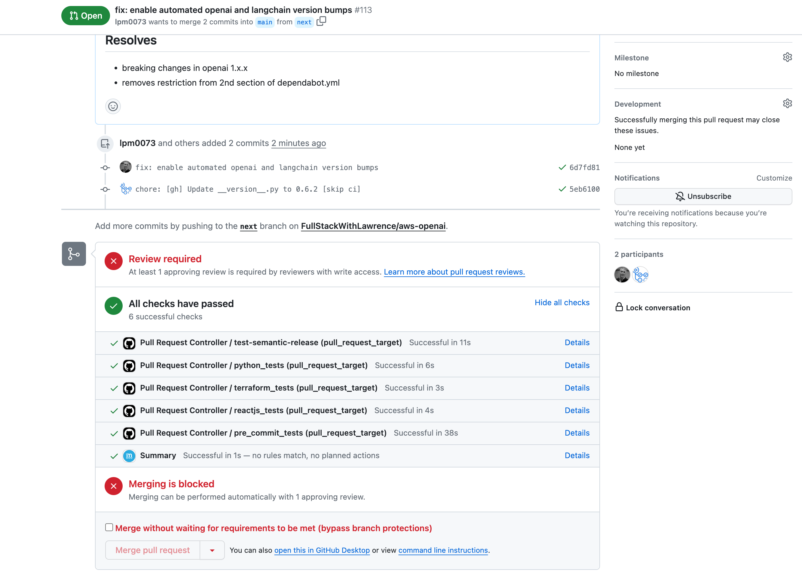
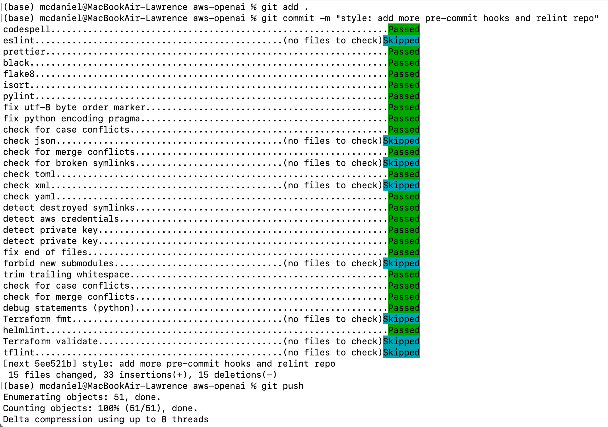
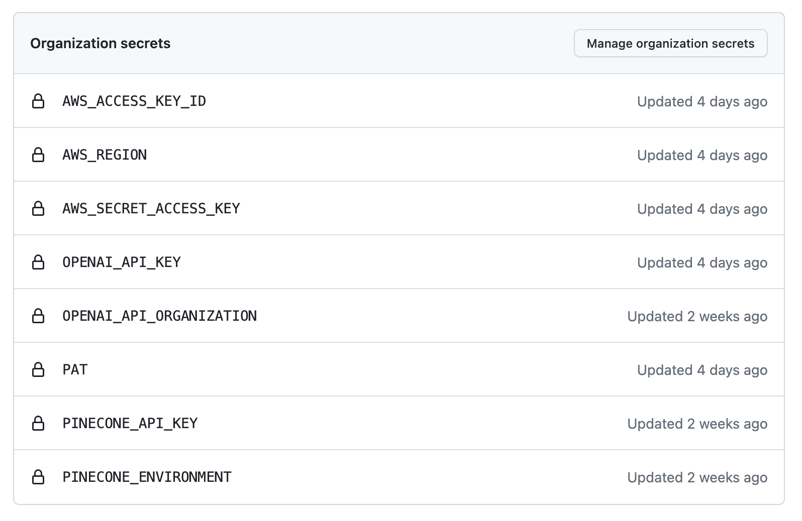

# Contributing - Developer Setup Guide

This repository contains three distinct projects, respectively, written in

- [ReactJS](#reactjs-setup)
- [Python](#python-setup)
- [Terraform](#terraform-setup)

In each case there are various technology-specific resources that you'll need to initialize in your development environment.

## Repository Setup

### GitHub Actions

As a 1-person operation this project depends heavily on GitHub Actions to automate routine activities, so that hopefully, the source code is always well-documented and easy to read, and everything works perfectly. We automate the following in this project:

- Code linting checks, during both pre-commit as well as triggered on pushes to the main branch
- Unit tests for Python, React and Terraform
- Semantic Version releases
- version bumps from npm, PyPi and Terraform Registry

A typical pull request will look like the following:



### pre-commit setup

This project uses pre-commit as a first-pass automated code review / QC process. pre-commit runs a multitude of utilities and checks for code formatting, linting, syntax checking, and ensuring that you don't accidentally push something to GitHub which you'd later regret. Broadly speaking, these checks are aimed at minimizing the extent of commits that contain various kinds of defects and stylistic imperfections that don't belong on the main branch of the project.

Note that many of the pre-commit commands are actually executed by Python which in turn is calling pip-installed packages listed in requirements.txt located in the root of the repo. It therefore is important that you first create the Python virtual environment using `make api-init`. It also is a good idea to do a complete 'dry run' of pre-commit, to ensure that your developer environment is correctly setup:

```console
git pull
make api-init
pre-commit autoupdate
pre-commit run --all-files
```

Output should look similar to the following:



### Github Secrets setup

The GitHub Actions automated processes depend on several credentials which are stored inside of Github Secrets. When creating pull requests, the GitHub Actions will use these secrets, [github.com/FullStackWithLawrence/aws-openai/settings/secrets/actions](https://github.com/FullStackWithLawrence/aws-openai/settings/secrets/actions), so there's nothing special for you to do.

On the other hand, if you've forked this repo and are working on your own independent project, then you'll need to initialize each of these yourself.



## Python Setup

This project includes four distinct Python project, all located in api/terraform/python. They are located here because each of these projects is deployed to AWS Lambda, which in turn is being actively managed by Terraform.

Note that this project leverages Dependabot for managing version numbers of all Python packages that are used in this project, regardless of where and how. Versions should always be up to date at the moment that you clone the repo. It therefore should never be necessary for you to manually bump PyPi package version numbers.

```console
git pull
make api-init
source venv/bin/activate
```

## ReactJS Setup

Please refer to this detailed [ReactJS setup guide](./client/README.md) for how to use vite.js to initialize the ReactJS development environment.

Note that this project leverages Dependabot for managing version numbers of all NPM packages that are used in this project, regardless of where and how. Versions should always be up to date at the moment that you clone the repo. It therefore should never be necessary for you to manually bump package.json version numbers.

```console
git pull
make client-init
```

## Terraform Setup

Please refer to this [Terraform setup guide](./api/README.md) for detailed instructions.

Note that this project leverages Dependabot for managing version numbers of all Terraform modules that are used in this project. Versions should always be up to date at the moment that you clone the repo. It therefore should never be necessary for you to manually bump module version numbers.

```console
git pull
cd api/terraform
terraform init
terraform plan
terraform apply
```
